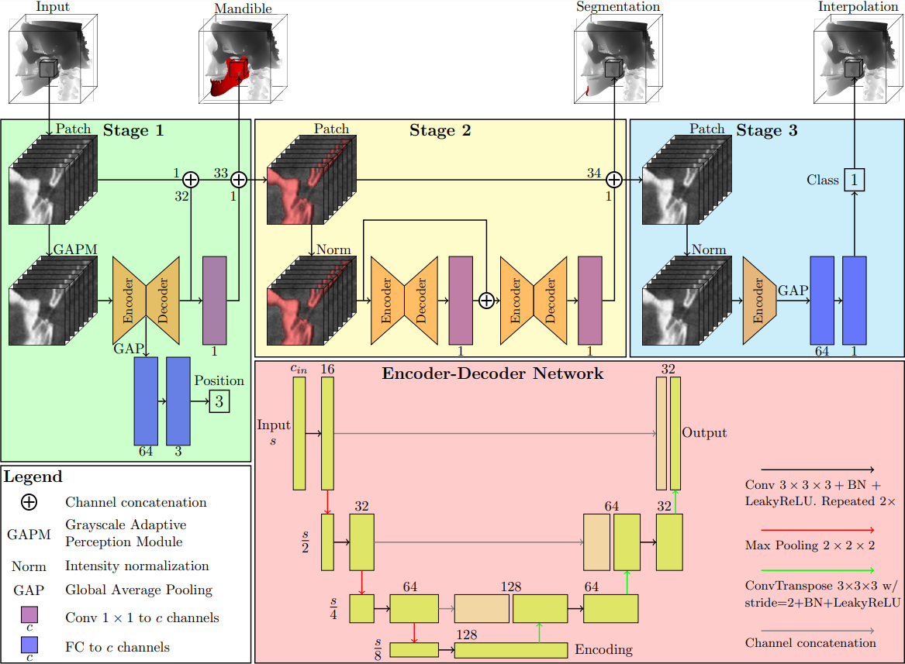

# JawFrac

Welcome to the repository accompanying the paper *JawFracNet: Detecting Mandibular Fractures in CBCT Scans using Three-Stage Deep Neural Network*.

An Algorithm of the method can be tried out at [Grand Challenge](https://grand-challenge.org/algorithms/jawfracnet/). Simply upload a NIfTI file containing a mandible and infer where fractures are detected.

## Input - Outputs

<p align="center"></p>

## Model




## Install with conda

```
conda install pytorch torchvision torchaudio cudatoolkit=11.3 -c pytorch
pip install torch-scatter -f https://data.pyg.org/whl/torch-1.11.0+cu113.html
pip install -r requirements.txt
```

## Replicate

When trying to replicate this work, the three stages should be trained separately.

### Mandible segmentation

Start with specifying the correct `work_dir` and `root` in the configuration file `jawfrac/config/mandibles.yaml`. The scan and annotation files are expected to be called `scan.nii.gz` and `label.nii.gz`, respectively. Label 2 in the annotation was used for the mandible, please make sure the mandible is annotated with the label 2!

Now run `train_mandibles.py`. The losses and metrics throughout training will be logged to TensorBoard in the working directory. Furthermore, a copy of the configuration file and checkpoints of the best models will also be stored.

Having trained the first stage, the mandible segmentations can be inferred by running `infer_mandibles.py`. If you want to infer different scans than the ones used during training, please specify the location of these scans in the configuration file. The inference results in a `mandible.nii.gz` file with the mandible segmentation as label 1.

### Fracture segmentation

Specify `work_dir`, `checkpoint_path`, and `root` in `jawfrac/config/fractures_linear.yaml` and train the second stage using the inferred mandible segmentation for improved efficiency. After training, results of the model can be visualized by running `infer_fractures_linear.py`.

### Fracture classification

Again, specify `work_dir`, `checkpoint_path`, and `root` in `jawfrac/config/fractures_linear_displaced.yaml` and train the third stage using the mandible and fracture segmentations. This final model can be used for inference with `infer_fractures_linear_displaced.py`.


## Cite

[Link to thesis](https://drive.google.com/file/d/1GYfgMn_ilXPVaxRsmNRaMZn2XRQxZnEd/view?usp=share_link)

```
@mastersthesis{
    author={Niels van Nistelrooij},
    title={JawFracNet: Detecting Mandibular Fractures in CBCT Scans using Three-Stage Deep Neural Network},
    institution={Radboud University},
    year={2022},
    month={12},
}
```
